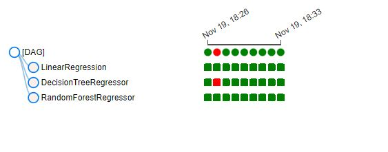

# Weather API DAG

The DAG get data from the OpenWeather API. Data is stored, transformed and trained against 3 Machine Learning models.

# DAG overview

**DAG**


**SUBDAG** (train_models)


The DAG provides data to a **dashboard** lauched from the `docker-compose.yaml`.

The **dashboard** is available at `http://vm_ip_adresse:8050`

The **DAG** is availale at `http://vm_ip_adresse:8050`

## Stages

| Stage | Description |
|------|-------------|
| `collect_data` | Get data from the OpenWeather API and save it into JSON files stored in `raw_files/`. |
| `data_to_csv_20_latest` | Transform **20 latest** JSON files into a CSV file stored in `clean_data/` to source the Dashboard. |
| `collect_data` |  Transform **all** the JSON files into a CSV file stored in `clean_data/` to train the ML models. |
| `prepare_data` | Extra stage from the original DAG to share the same dataset for the 3 models.It saves the dataframe in form of `features` and `label` into a CSV file stored in the `clean_data` folder |
| `train_models` | Subdag for **Cross Validation** for Linear Regression, Decision Tree and Random Forest models on the cleaned dataset |
| `best_model_selection`| Take the best score from the 3 models and train again for the whole dataset and saves the Pickle file in `clean_data/` |


# Files

- [docker-compose.yaml](docker-compose.yaml) : Start the DAG. Contains *Airflow* and *Dash* services
- [dag.py](dag.py) : code for the DAG
- [subdag.py](subdag.py) : SubDAG code for model training


# Setup

Write the following commands in a terminal:

```bash
# Airflow directories
mkdir ./dags ./logs ./plugins

# creating data directories
mkdir clean_data
mkdir raw_files

# Write the following environment variables into the file .env
echo -e "AIRFLOW_UID=$(id -u)\nAIRFLOW_GID=0" > .env

# Initialize airflow
docker-compose up airflow-init

# Start airflow
docker-compose up -d
```
# OpenWeather Response Example

```json
[
    {
        "coord": {
            "lon": 2.3488,
            "lat": 48.8534
        },
        "weather": [
            {
                "id": 800,
                "main": "Clear",
                "description": "clear sky",
                "icon": "01n"
            }
        ],
        "base": "stations",
        "main": {
            "temp": 280.53,
            "feels_like": 278.15,
            "temp_min": 278.12,
            "temp_max": 282.1,
            "pressure": 1008,
            "humidity": 88
        },
        "visibility": 10000,
        "wind": {
            "speed": 3.6,
            "deg": 250
        },
        "clouds": {
            "all": 0
        },
        "dt": 1668805902,
        "sys": {
            "type": 2,
            "id": 2041230,
            "country": "FR",
            "sunrise": 1668755044,
            "sunset": 1668787662
        },
        "timezone": 3600,
        "id": 2988507,
        "name": "Paris",
        "cod": 200
    },
    {
        "coord": {
            "lon": -0.1257,
            "lat": 51.5085
        },
        "weather": [
            {
                "id": 804,
                "main": "Clouds",
                "description": "overcast clouds",
                "icon": "04n"
            }
        ],
        "base": "stations",
        "main": {
            "temp": 282.51,
            "feels_like": 282.51,
            "temp_min": 280.94,
            "temp_max": 283.71,
            "pressure": 1006,
            "humidity": 78
        },
        "visibility": 10000,
        "wind": {
            "speed": 0.89,
            "deg": 290,
            "gust": 4.02
        },
        "clouds": {
            "all": 100
        },
        "dt": 1668805919,
        "sys": {
            "type": 2,
            "id": 2075535,
            "country": "GB",
            "sunrise": 1668756209,
            "sunset": 1668787685
        },
        "timezone": 0,
        "id": 2643743,
        "name": "London",
        "cod": 200
    },
    {
        "coord": {
            "lon": -120.5015,
            "lat": 47.5001
        },
        "weather": [
            {
                "id": 800,
                "main": "Clear",
                "description": "clear sky",
                "icon": "01d"
            }
        ],
        "base": "stations",
        "main": {
            "temp": 273.05,
            "feels_like": 270.83,
            "temp_min": 271.37,
            "temp_max": 277.36,
            "pressure": 1037,
            "humidity": 66,
            "sea_level": 1037,
            "grnd_level": 976
        },
        "visibility": 10000,
        "wind": {
            "speed": 1.81,
            "deg": 93,
            "gust": 1.61
        },
        "clouds": {
            "all": 0
        },
        "dt": 1668806054,
        "sys": {
            "type": 2,
            "id": 2019804,
            "country": "US",
            "sunrise": 1668784294,
            "sunset": 1668817390
        },
        "timezone": -28800,
        "id": 5815135,
        "name": "Washington",
        "cod": 200
    }
]
```

# Dashboard


# DAG Runs

**DAG**


**SUBDAG**




# Variables


# XCom


